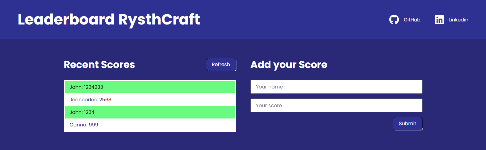

<!-- TABLE OF CONTENTS -->

# 📗 Table of Contents

- [📖 About the Project](#about-project)
  - [🛠 Built With](#built-with)
    - [Tech Stack](#tech-stack)
    - [Key Features](#key-features)
    - [Future Features](#future-features)
  - [🚀 Live Demo](#live-demo)
- [💻 Getting Started](#getting-started)
  - [Setup](#setup)
  - [Test](#test)
- [👥 Authors](#authors)
- [🤝 Contributing](#contributing)
- [⭐️ Show your support](#support)
- [🙏 Acknowledgements](#acknowledgements)
- [📝 License](#license)

<!-- PROJECT DESCRIPTION -->

# 📖 ES6 Leaderboard Application<a name="about-project"></a>

**ES6 Leaderboard Application** The leaderboard website displays scores submitted by different players. It also allows you to submit your score. All data is preserved thanks to the external [Leaderboard API service](https://www.notion.so/microverse/Leaderboard-API-service-24c0c3c116974ac49488d4eb0267ade3). Built with HTML, CSS, and JavaScript.

## 🛠 Built With <a name="built-with"></a>

### Tech Stack <a name="tech-stack"></a>

<details>
  <summary>Client</summary>
  <ul>
    <li><a href="https://www.w3schools.com/html/">HTML</a></li>
    <li><a href="https://www.w3schools.com/css/">CSS</a></li>
    <li><a href="https://www.w3schools.com/js/">JavaScript</a></li>
  </ul>
</details>

<!-- Features -->

### Key Features <a name="key-features"></a>

- Add new names with their score.
- Display a list of people.

<p align="right">(<a href="#readme-top">back to top</a>)</p>

### Future Features <a name="future-features"></a>

- **Implement a CSS Preprocessor.**
- **Implement a Database**

<p align="right">(<a href="#readme-top">back to top</a>)</p>

## 🚀 Live Demo <a name="live-demo"></a>

### Take a Look



- [Live Demo Link](https://rysth.github.io/ES6-Leaderboard/dist/)

<p align="right">(<a href="#readme-top">back to top</a>)</p>

## 💻 Getting Started <a name="getting-started"></a>

To get a local copy up and running, follow these steps.

### Setup

To get a local copy up and running, follow these steps:

1. Clone the repository: `git clone https://github.com/RysthCraft/ES6-Leaderboard.git`
2. Navigate to the project directory: `cd ES6-Leaderboard`
3. Install the dependencies: `npm install`
4. Build the project: `npm run build`
5. Open `index.html` in your web browser.

Then, you will change everything you want!

### Test

In order to follow the Linters you could check them using this:

```
HTML Checker:
npx hint .

CSS Checker:
npx stylelint "**/*.{css,scss}"

JavaScript Checker:
npx eslint .
```

#### Note

Use at the end '--fix' to help you out with any error.

## 👥 Authors <a name="authors"></a>

👤 **Rysth**

- GitHub: [@rysth](https://github.com/RysthCraft)
- Linkedin: [@johnpalacios](https://www.linkedin.com/in/john-palacios-rysth/)

<p align="right">(<a href="#readme-top">back to top</a>)</p>

## 🤝 Contributing <a name="contributing"></a>

Contributions, issues, and feature requests are welcome!

Feel free to check the [issues page](../../issues/).

<p align="right">(<a href="#readme-top">back to top</a>)</p>

## ⭐️ Show your support <a name="support"></a>

If you like this project feel free to watch it and take some features that will enhance your project
as well.

<p align="right">(<a href="#readme-top">back to top</a>)</p>

## 🙏 Acknowledgments <a name="acknowledgements"></a>

I would like to thank the Microverse Team for reviewing my code and making me a better
professional.

<p align="right">(<a href="#readme-top">back to top</a>)</p>

## 📝 License <a name="license"></a>

This project is [MIT](./LICENSE.md) licensed.

<p align="right">(<a href="#readme-top">back to top</a>)</p>
